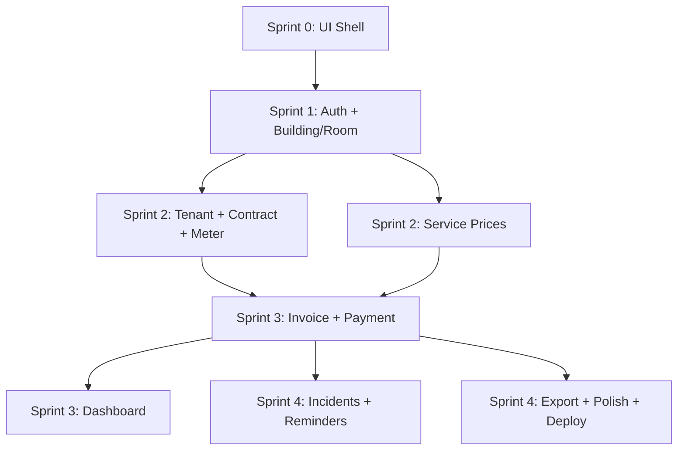

# Blueprint: Hệ thống Quản lý Chung cư Mini — MBP 5 Sprint (4 tuần)

---

## Tổng quan

| Hạng mục | Chi tiết |
|----------|----------|
| **Đối tượng** | Chủ/quản lý 1–5 toà chung cư mini (20–150 phòng) |
| **Vấn đề** | Dùng Excel + Zalo → sai sót, mất thời gian hoá đơn, quên thu tiền |
| **Mục tiêu MBP** | Giảm ≥70% thời gian hoá đơn; giảm lỗi thu tiền → ~0 cho 3–5 toà pilot |
| **Core loop** | Cấu hình toà/phòng → Nhập điện/nước → Tạo hoá đơn → Thu tiền → Dashboard |
| **Timeline** | 4 tuần = Sprint 0 (3 ngày) + Sprint 1–4 (mỗi sprint ~6 ngày) |

---

## Kế hoạch Sprint — Tổng quan

```
Sprint 0 (3 ngày) ─── UI/UX Foundation & Design System
    │
Sprint 1 (6 ngày) ─── Auth + Building/Room (CRUD + CSV Import)
    │
Sprint 2 (6 ngày) ─── Tenant + Contract + Meter Records
    │
Sprint 3 (6 ngày) ─── Invoice Engine + Payments + Dashboard
    │
Sprint 4 (5 ngày) ─── Incidents + Reminders + Polish + Deploy
```

---

## 🎨 Sprint 0 — UI/UX Foundation & Design System (3 ngày)

> **Agents:** `frontend-specialist` + `project-planner`
> **Skills:** `frontend-design`, `react-patterns`, `nextjs-best-practices`, `clean-code`

### Mục tiêu
Xây dựng **UI shell hoàn chỉnh** với layout, navigation, design tokens và các page placeholder — để user nhìn thấy "bộ khung" giao diện trước khi đi vào tính năng.

### Deliverables

| # | Task | Chi tiết | Verify |
|---|------|----------|--------|
| 0.1 | **Setup project** | Next.js 14 (App Router) + Ant Design 5 + Supabase client + TypeScript strict | `npm run dev` chạy OK |
| 0.2 | **Design System & Tokens** | Color palette, typography scale, spacing (8pt grid), border-radius, shadow hierarchy — tạo `theme/` config cho Ant Design | Ant Design ConfigProvider áp dụng đúng tokens |
| 0.3 | **Layout Shell** | Sidebar (collapsible) + TopBar (user menu, notification bell, breadcrumb) + Content area responsive | Resize browser → sidebar collapse, content reflow |
| 0.4 | **Navigation & Routing** | Menu sidebar với tất cả 9 module, active state, icon mỗi item, route group `(auth)` + `(dashboard)` | Click menu → URL đổi, page placeholder render |
| 0.5 | **Page Placeholders** | Tạo trang placeholder cho mọi route (empty state card: icon + "Tính năng đang phát triển") | Điều hướng toàn bộ menu → mỗi trang có content |
| 0.6 | **Auth Pages (UI only)** | Login page + Register page (form, validation UI, responsive) — chưa kết nối backend | Form render đúng, validation UX hoạt động |
| 0.7 | **Shared Components** | `StatusTag`, `ConfirmModal`, `SearchInput`, `EmptyState`, `PageHeader`, `StatCard` | Import & render được ở page test |
| 0.8 | **Responsive check** | Test toàn bộ shell trên mobile (375px), tablet (768px), desktop (1440px) | Layout không bị vỡ ở 3 breakpoint chính |

### Design Decisions cần xác nhận với user

| Quyết định | Gợi ý | Lý do |
|------------|-------|-------|
| **Color palette** | Teal (#0D9488) + Warm Gray nền + Coral accent (#F97316) | Trust (teal) + Energy (coral) — phù hợp quản lý bất động sản; tránh blue quá generic |
| **Typography** | Inter (body) + Plus Jakarta Sans (headings) | Professional, dễ đọc, hỗ trợ Vietnamese diacritics tốt |
| **Geometry** | Border-radius 8-12px (friendly admin), sharp 2px cho cards data-heavy | Admin tool cần thân thiện nhưng không quá "mềm" |
| **Sidebar style** | Dark sidebar + Light content (high contrast) | Quen thuộc với admin panels, dễ scan menu |
| **Layout** | Fixed sidebar (240px) + Fluid content | Standard cho productivity app nhiều table/form |

---

## Sprint 1 — Auth & Core Entities (6 ngày)

> **Agents:** `backend-specialist`, `database-architect`, `frontend-specialist`
> **Skills:** `database-design`, `api-patterns`, `nextjs-best-practices`, `clean-code`

| # | Task | Chi tiết |
|---|------|----------|
| 1.1 | Supabase schema: `organizations`, `user_profiles`, `buildings`, `rooms` + RLS | SQL migration + seed data |
| 1.2 | Auth: Register (tạo org) + Login → Supabase Auth + middleware guard | Email/password, JWT |
| 1.3 | CRUD Buildings | Card grid, form modal, stats per building |
| 1.4 | CRUD Rooms | Table trong building detail, status badge (vacant/occupied/maintenance) |
| 1.5 | Import rooms từ CSV/Excel | Upload → preview → confirm → insert |
| 1.6 | Settings page | Org info + user profile |

**Deliverable:** Đăng ký → Đăng nhập → Tạo toà → Thêm/import phòng → Xem grid phòng

---

## Sprint 2 — Tenants, Contracts & Meters (6 ngày)

> **Agents:** `frontend-specialist`, `database-architect`
> **Skills:** `database-design`, `react-patterns`, `clean-code`

| # | Task | Chi tiết |
|---|------|----------|
| 2.1 | Schema: `tenants`, `contracts`, `service_prices`, `meter_records` + RLS | Migration |
| 2.2 | CRUD Tenants | Table, search, detail page + CCCD upload (Supabase Storage) |
| 2.3 | CRUD Contracts | Form: chọn room → tenant → giá → ngày; upload scan HĐ |
| 2.4 | Service Prices | Cấu hình đơn giá theo toà (settings tab) |
| 2.5 | Meter Records | Editable table: chọn toà × tháng; auto-fill số cũ |
| 2.6 | Room detail | Hiện HĐ hiện tại, tenant info, meter history |

**Deliverable:** Thêm khách → Ký hợp đồng → Cấu hình giá → Nhập chỉ số điện nước

---

## Sprint 3 — Invoice Engine & Payments (6 ngày)

> **Agents:** `backend-specialist`, `frontend-specialist`
> **Skills:** `api-patterns`, `database-design`, `react-patterns`, `clean-code`

| # | Task | Chi tiết |
|---|------|----------|
| 3.1 | Schema: `invoices`, `invoice_items` + RLS | Migration |
| 3.2 | Invoice calc logic | API route: tính tiền = rent + (meter × giá) + services cố định |
| 3.3 | Batch generate | Tạo hoá đơn cho toàn bộ phòng occupied của 1 toà/tháng |
| 3.4 | Invoice list | Table, filter tháng/toà/trạng thái, batch actions |
| 3.5 | Invoice detail | Line items, tổng tiền, trạng thái |
| 3.6 | Payment tracking | Modal thu tiền (partial/full) → cập nhật `amount_paid` + status |
| 3.7 | Dashboard | Stat cards + charts (doanh thu, công nợ, occupancy) |

**Deliverable:** Batch tạo hoá đơn → Xem chi tiết → Thu tiền → Dashboard KPIs ✅ **Core loop done**

---

## Sprint 4 — Polish, Incidents & Deploy (5 ngày)

> **Agents:** `frontend-specialist`, `backend-specialist`, `devops-engineer`, `test-engineer`
> **Skills:** `deployment-procedures`, `testing-patterns`, `performance-profiling`, `clean-code`

| # | Task | Chi tiết |
|---|------|----------|
| 4.1 | Schema: `incidents`, `reminders` + RLS | Migration |
| 4.2 | Incidents CRUD | Table, form, status flow (open → in_progress → resolved) |
| 4.3 | Reminders | Auto-gen (HĐ sắp hết, hoá đơn quá hạn) via pg_cron/Vercel Cron |
| 4.4 | Notification bell | Badge count + dropdown + reminders page |
| 4.5 | Export hoá đơn | PDF hoặc print-friendly page |
| 4.6 | UX polish | Loading states, empty states, error handling, responsive fine-tune |
| 4.7 | Testing | Seed data + manual test toàn flow + unit test invoice-calc |
| 4.8 | Deploy | Vercel production + Supabase production project |

**Deliverable:** Sự cố, nhắc việc, export, deploy production 🚀

---

## Dependency Graph



---

## Kiến trúc & Tech Stack

| Layer | Công nghệ |
|-------|-----------|
| **Frontend** | Next.js 14 (App Router) + Ant Design 5 |
| **API** | Next.js Route Handlers |
| **Database** | Supabase Postgres + RLS |
| **Auth** | Supabase Auth (email + password) |
| **Storage** | Supabase Storage |
| **Cron** | pg_cron hoặc Vercel Cron |
| **Deploy** | Vercel + Supabase Cloud |

---

## Database — 12 bảng chính

| Nhóm | Bảng |
|------|------|
| **Core** | `organizations`, `user_profiles` |
| **Property** | `buildings`, `rooms` |
| **People** | `tenants`, `contracts` |
| **Pricing** | `service_prices`, `meter_records` |
| **Billing** | `invoices`, `invoice_items` |
| **Operations** | `incidents`, `reminders` |

> Chi tiết SQL schema đầy đủ → xem file `implementation_plan.md` trong artifact.
